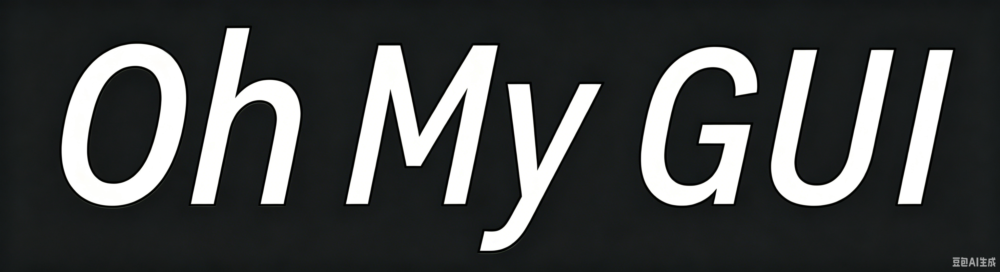

<div align="center">




# OhMyGUI
> A lightweight GUI library wrapping PySide6 for Python!


[](https://python.org)

[](LICENSE)

</div>

<details>
    <summary>Table of Contents</summary>
    <li>
        <a href="#introduction">Introduction</a>
    </li>
    <li>
        <a href="#core-features">Core Features</a>
    </li>
    <li>
        <a href="#suitable-scenarios">Suitable Scenarios</a>
    </li>
    <li>
        <a href="#getting-started">Getting Started</a>
    </li>
    <li>
        <a href="#notice">NOTICE</a>
    </li>
    <li>
        <a href="#roadmap">Roadmap</a>
    </li>
    <li>
        <a href="#contributing">Contributing</a>
    </li>
    <li>
        <a href="#license">License</a>
    </li>
    <li>
        <a href="#contact">Contact</a>
    </li>
    <li>
        <a href="#acknowledgments">Acknowledgments</a>
    </li>
    <li>
        <a href="#conclusion">Conclusion</a>
    </li>
</details>


# Introduction
🚀 A lightweight, neatly structured cross-platform general utility library developed based on PySide6 & Python, bundling **window management, widget encapsulation, style control and basic component toolkit**. It is built for GUI rapid development, lightweight desktop application building and personalized component secondary development scenarios.

In daily PySide6 GUI development, developers often repeatedly write window creation, widget binding, position adjustment and color style code in different projects. Scattered custom components lack unified encapsulation, inconsistent calling styles lead to high adaptation costs, and most ready-made component frameworks are overly bloated or have strong coupling, which is not friendly for lightweight projects and beginners. There are few concise, decoupled and easy-to-expand basic GUI tool suites that integrate window control and common widgets. To solve these pain points, I developed this project, aiming to build a set of standardized, low-coupling and long-term maintainable basic GUI underlying tool library.

This project is highly suitable for being integrated into various PySide6 GUI development projects for the following reasons:
- Avoid repeated wheel-making for basic logic such as window initialization, widget binding and position setting, allowing developers to focus more on core business and interactive logic.
- Adopt unified coding specifications, consistent interface calling styles and standardized encapsulation logic, getting rid of the chaos caused by scattered custom widgets.
- Good cross-platform compatibility, running stably on Windows, Linux and macOS, adapting to common desktop development environments.
- Follow native PySide6 usage specifications, retain intuitive calling logic while encapsulating complex underlying operations, with high code readability, convenient for debugging, modification and later function iteration.
- Each functional module is decoupled from each other, supporting selective reference and use, without introducing excess redundant code, and will not increase project volume and runtime overhead.
- Rich built-in practical capabilities: **window size locking/unlocking, position adjustment, dynamic widget binding, component show/hide, foreground/background color modification, text content management** and other commonly used GUI functions, covering most demands of lightweight GUI development.

Certainly, this basic tool library is mainly oriented to conventional lightweight GUI scenarios and does not involve complex advanced functions such as high-customization controls, special animation effects and large-scale client architecture. I will keep maintaining and iterating the project later, continuously enrich component types, optimize underlying logic, fix compatibility problems, and expand more practical auxiliary functions according to actual development needs. All developers are welcome to star the project. You can put forward function suggestions and optimization ideas via Issues, and polish this lightweight GUI basic tool library together. Every use and feedback from users is the driving force for the continuous improvement of this project.

## Core Features
- ✨ **Native PySide6 Based Implementation**
  Developed relying on standard PySide6 APIs, compatible with mainstream Python versions, simple access and seamless integration into existing PySide6 projects.
- 🪟 **Full-Featured Window Management**
  Support window title setting, size adjustment, position moving, one-click locking/unlocking window size, and provide native window object escape interface for secondary development.
- 🧩 **Encapsulated Basic Widget System**
  Complete encapsulation based on native QWidget and QLabel, integrate common operations such as component display/hide, position and size setting, forming a unified basic component system.
- 🎨 **Convenient Style Control**
  Support dynamic acquisition and modification of component text content, foreground color and background color, simplify style operation code, and avoid repeated writing of style sheets.
- 🔗 **Dynamic Widget Binding**
  Realize dynamic creation and binding of widgets, unified management of component stack, flexible addition of multiple UI elements at runtime.
- 🔄 **Cross-Platform Stable Operation**
  Follow PySide6 cross-platform design ideas, no platform-specific code, all core functions run consistently on Windows / Linux / macOS.
- 📦 **Module Decoupling & Flexible Quotation**
  Window management and basic widget modules are completely decoupled, supporting independent introduction and separate use, matching different project development demands flexibly.
- 🧹 **Clear Structure & Easy Expansion**
  Hierarchical code design, clear function classification, reserved expansion interfaces, convenient for users to expand custom widgets and extend personalized functions on the existing framework.
- 🎯 **Lightweight & Low Overhead**
  Focus on practical basic GUI capabilities, discard redundant complicated functions, occupy few system resources, and adapt to small tools, desktop gadgets and other lightweight projects.

## Suitable Scenarios
- Personal daily PySide6 learning practice and small GUI tool development
- Rapid development of lightweight desktop gadgets and console auxiliary clients
- Simple desktop application construction that requires unified management of basic UI components
- Beginner's PySide6 programming learning and code standardization training
- Unify basic GUI underlying code of small and medium-sized projects to reduce repeated development
- Secondary development and function expansion based on basic encapsulated widgets
- Development of simple upper computer auxiliary interface and small interactive program
- Finishing and sorting of daily accumulated PySide6 basic GUI code snippets

## Getting Started
[**Explore the docs >>>**](docs)

[**Explore the examples >>>**](example)

Here is an example to run.

At first, please clone the repository on your local computer:
```bash
git clone https://github.com/FishgameStudio/oh-my-gui.git
```

*Please keep the copyright comments in the source ode file while using.*
*if you modified our source code, please insert these lines into your code:*
```python
# Modified by [Your Name] [Modified Date]
# Changes: [Modified Content]
```
To use the APIs of this project, please install them down:
```bash
pip install .
```
And you can use the APIs:
```python
import ohmygui.core as core
import ohmygui.widget as widget
import ohmygui.layout as layout

app = core.App()
window = core.Window("Horizontal Layout Example", (400, 200))
layout = layout.HorizentalLayout()

layout.add_widget(widget.Text("Hello"))
layout.add_spacing(20)
layout.add_widget(widget.Text("World"))
layout.add_stretch()
layout.add_widget(widget.Text("!"))
window.set_layout(layout)
window.show()
app.run()
```


## NOTICE
This project uses **`PySide6`** as the GUI core dependency. Please ensure **`PySide6` is installed** in your Python environment before running or building the project.

## Roadmap
- [x] **v1.0.0**\[Official Stable Version\]: launch on PyPI
- [x] **v1.1.0**: Add more widget extensions & add CHANGELOG.md
- [ ] **v1.2.0**: Create OML & OMS
- [ ] **v1.3.0**: Improve animations
- [ ] **v1.4.0**: 3D engine support
- [ ] **v1.5.0**: Improve docs, FAQ, examples
- [ ] **v1.9.0**\[Release Candidate\]: Freeze APIs, fix most bugs
- [ ] **v2.0.0**\[Official Stable Version\]: launch on PyPI

See the [open issues](https://github.com/FishgameStudio/oh-my-gui/issues) for a full list of proposed features (and known issues).

## Contributing

Contributions are what make the open source community such an amazing place **to learn, inspire, and create**. Any contributions you make are **greatly appreciated**.

If you have a suggestion that would make this better, please **fork the repo** and **create a pull request**. You can also simply open an issue with the tag **"enhancement"**.
Don't forget to give the project a star! Thanks again!

1. Fork the Project
2. Create your Feature Branch (`git checkout -b feat/AmazingFeature`)
3. Commit your Changes (`git commit -m 'Add some AmazingFeature'`)
4. Push to the Branch (`git push origin feat/AmazingFeature`)
5. Open a Pull Request

### Top contributors:

<a href="https://github.com/FishgameStudio/oh-my-gui/graphs/contributors">
  
</a>

## License

Distributed under the MIT License. See [LICENSE](LICENSE) for more information.


## Contact

Nicola Grey - [popxhxh@outlook.com](mailto:popxhxh@outlook.com)

Project Link: [https://github.com/FishgameStudio/oh-my-gui](https://github.com/FishgameStudio/oh-my-gui)


## Acknowledgments

* [Best-README-Template](https://github.com/othneildrew/Best-README-Template)
* [PySide6](https://github.com/pyside/pyside-setup)


## Conclusion
Hope this lightweight UtilitiesLibrary can assist you in daily C++ development, simplify repetitive basic logic writing, and speed up your project construction efficiency.

Every star, fork and sincere feedback means a lot to me. You are warmly welcome to submit issues for bugs feedback and function suggestions, or send pull requests to participate in code optimization and function iteration, so as to polish and improve this utility library together.

If you find this project practical and helpful, don’t forget to hit **Star** and **Fork**. All valuable opinions and ideas are **sincerely welcomed**. Thank you very much for your support!